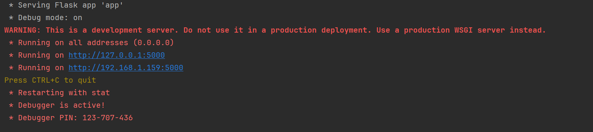

# LZW compression Implementation website

This repository represent the final project in course 
'Information Theory' by Or Shkuri and Yuli Tshuva.

The repository contains a flask web application that is fully
interfaced with compression and decompression by LZW algorithm
which has been proven to be the best among all available algorithms at its time
(and even being used in these days).

A bit about the LZW algorithm (from Wikipedia):

Lempel–Ziv–Welch (LZW) is a universal lossless data compression 
algorithm created by Abraham Lempel, Jacob Ziv, and Terry Welch. 
It was published by Welch in 1984 as an improved implementation of 
the LZ78 algorithm published by Lempel and Ziv in 1978. 
The algorithm is simple to implement and has the potential for very 
high throughput in hardware implementations. It is the algorithm of the 
Unix file compression utility compress and is used in the GIF image format.

You can read more about the algorithm in the following link:
https://en.wikipedia.org/wiki/Lempel%E2%80%93Ziv%E2%80%93Welch

To activate the web application, first clone the repository.

The <b>only</b> requirement for the website is the package flask.
So make sure you have it installed by the command 
```pip install flask```.

Now, you are all set!

To run the web application, go to /app directory and run the command
```python app.py```.

Immediately the following output will appear on your terminal:


This is a good sign which means the server is up and running.
To visit the website, click on the link provided in the terminal.

The website is very simple and user-friendly and supply both compression and decompression services.

For example, you are more than welcome to download the file from the Example page and try to compress and then decompress it.
You will be impressed by the results! The website perfectly compresses and decompresses the file - lossless.

<b>Note:</b> The website is not yet deployed, so you can only run it locally.

<b>Note:</b> The website only allow text files to be 
uploaded for compression. For decompression the website only allows the lzw file the website supplies.
